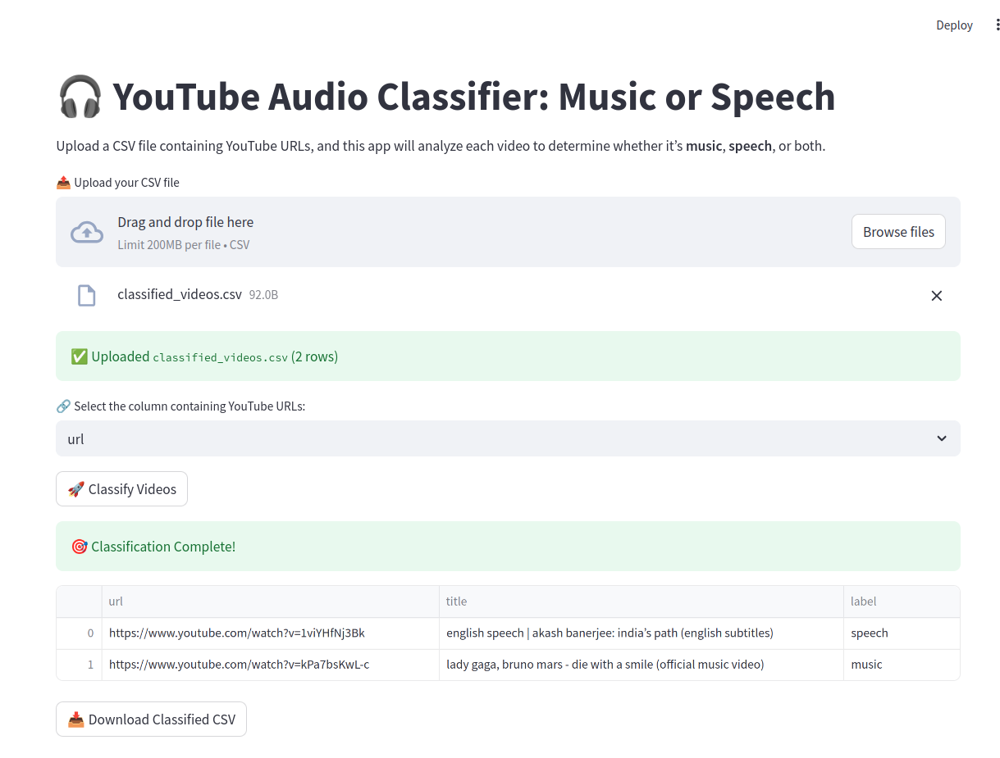

# 🎧 YouTube Audio Classifier

Classify YouTube videos into **Music**, **Speech**, or both by analyzing titles, descriptions, and transcripts.

## 🚀 Features
- Upload CSV with YouTube URLs
- Automatic classification using metadata and transcript
- Downloadable results
- Fully interactive Streamlit UI

## 🖥️ Demo Screenshot


## 🛠️ Tech Stack
- Python
- Streamlit
- PyTubeFix
- YouTube Transcript API

## ⚙️ How to Run

```bash
pip install -r requirements.txt
streamlit run app.py

```
---

### ✅ Next Steps

1. 📸 Take a screenshot of your Streamlit app and place it in `assets/screenshot.png`.
2. ✅ Push the whole folder to GitHub:
   ```bash
   git init
   git remote add origin https://github.com/getahunTiruneh/youtube-audio-classifier.git
   git add .
   git commit -m "Initial commit"
   git push -u origin main
